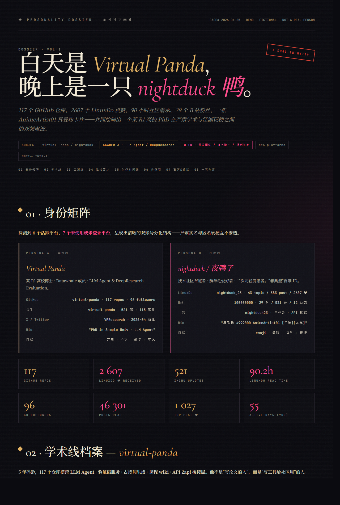

# Case 3：自我探寻 · 全网社交画像

> **学完本章，你将掌握如何让 GA 自动探测你已登录的所有社交平台、抓你公开发过的内容与互动指标，蒸馏出一份「快速版 Markdown + 深度版 HTML」双格式同源画像。聪明的读者一定会触类旁通——把同一套流程换个主语，就是"我的开源项目舆情画像""我团队的协作风格画像"。**

> **📍 For GA · 给智能体看的输入**
>
> ```text
> 帮我全网的社交平台平台做个性格分析，发过的贴子和内容。
> ```
>
> 上面这段是用户原话，**直接复制粘贴给 GA 就能跑**——读者无需关心 GA 怎么拆解。
> 下面是给**人类读者**看的章节解析：GA 把这一句话拆成了哪些步、为什么这么拆、踩了哪些坑。

---

## 🎯 学习目标

1. 理解 GA「**自我授权**」抓取与「**他人画像**」的伦理边界
2. 学会「探测已登录 tab → 平台公开 API 抓取 → reasoning 蒸馏 → JSON 中间态 → MD + HTML 同源渲染 → 合规收尾」六步流程
3. 掌握「**双格式同源**」的工程化思维——同一份中间态，多个渲染分支



> *上图是 `assets/dossier_deep_demo.html` 的实际渲染（虚拟身份 `Virtual Panda` /
> `nightduck` 鸭，纯属虚构）。同一份 JSON 同时输出 MD 和 HTML——加 PDF/PPT 只多一个分支。*

---

## 16.1 适用场景

> 💡 本章方法适用于 **"我自己想看清自己在多个平台分别长什么样"** 这种"自我洞察"需求——
> GA 用的是你已经登录的浏览器、抓的是你自己的内容、最后的判读也是给你看的。
> 这是这条 case 在伦理与合规上**最干净的一类**：自我授权、本地落盘、可随时删除。

> ⚠️ **不要把这套 prompt 用在别人身上**。给陌生 handle 做侧写需要：① 公开数据 ② 明确同意 ③ 可删除权——门槛要高得多。给同事画像是另外一件性质的事，要走另外一条 prompt。

---

## 16.2 整体流程概览

不管你登录了几个平台，GA 的核心步骤都是这六步：

```
┌─────────────┐
│  Step 1     │  探测：枚举已登录 tab，区分 active / inactive 平台
│  发现        │  cookie 状态 + 个人页 DOM 双重确认"我登录了"
└──────┬──────┘
       ▼
┌─────────────┐
│  Step 2     │  抓取：各平台公开 API / DOM
│  采样        │  GitHub / 知乎 / Discourse / B站 / X / ...
└──────┬──────┘
       ▼
┌─────────────┐
│  Step 3     │  落盘：raw_*.json（结构化）+ content.txt（喂模型）
│  双轨存储    │  默认本地，**不上传**
└──────┬──────┘
       ▼
┌─────────────┐
│  Step 4     │  蒸馏：reasoning 模型 JSON-mode 一次调用
│  统一口径    │  big5 / mbti / values / blindspots / verdict
└──────┬──────┘
       ▼
┌─────────────┐
│  Step 5     │  渲染：JSON 中间态 → MD + HTML 双产物
│  同源        │  快速版给自己看 / 深度版给同行看
└──────┬──────┘
       ▼
┌─────────────┐
│  Step 6     │  收尾：合规声明 + ask_user 是否保留 raw_* 数据
│  自我授权    │  随时一键 rm 让画像"凭空消失"
└─────────────┘
```

> 🎯 **设计精髓**：所有数字、引语、判读结论先落 **JSON 中间态**，再分别渲染 MD 和 HTML——发现数字不对，改 JSON，**不要去改 MD/HTML**。这个范式让"加 PDF / PPT 版本"只多一个渲染分支。详见 [`sop/dossier_dual_render.md`](./sop/dossier_dual_render.md)。

---

## 16.3 本案用到的能力（动手前先看一眼）

### GA 内置能力（开箱即用，不需要额外安装）

- `web_tabs` / `web_scan` / `web_execute_js`：枚举 Chrome 已登录 tab、各平台公开 API 同源 fetch
- `web_cdp Network.getAllCookies`：HttpOnly cookie 验证登录态（只读"是否已登录"，不导出 cookie 内容）
- `ask_user`：合规收尾——询问保留还是删除原始抓取数据
- `memory_management_sop`（GA 内置）：可选——把"用户的双身份特征"沉淀成长期记忆，下次问答可复用

### 本案专属 SOP（已打包到 [`sop/`](./sop/)）

| 文件 | 用途 |
|---|---|
| [`sop/discourse_shot.md`](./sop/discourse_shot.md) | LinuxDo / Meta 类 Discourse 引擎的三联端点（`/u/{u}.json + /summary.json + /activity.json`）一把抓 |
| [`sop/dossier_dual_render.md`](./sop/dossier_dual_render.md) | JSON 中间态 → MD + HTML 双格式同源渲染范式 |
| [`sop/social_persona_self.md`](./sop/social_persona_self.md) | 弱模型 fallback SOP（链路一图 + 11 条避坑 + 完整润色后 prompt） |

### 外部 SKILL（已完整复制到 [`sop/frontend-design/`](./sop/frontend-design/)）

| SKILL | 复制源 | 用途 |
|---|---|---|
| `sop/frontend-design/SKILL.md` + `references_minimax/` | `memory/frontend-design/` | HTML 视觉走它的「反 AI slop」主张：暗金 / 粉红双色调 + Cormorant Garamond + JetBrains Mono + Noto Serif SC，避免 Inter + 紫色渐变 |

---

## 16.4 Step 1：探测已登录平台

第一步不是"猜用户在哪些平台"，而是**看 Chrome 已经开着哪些 tab**：

```python
tabs = web_tabs()
# 正则匹配主流社交平台
SOCIAL_RE = r'(github|zhihu|x\.com|twitter|weibo|jike|xiaohongshu|douban|'\
            r'bilibili|douyin|linux\.do|v2ex|reddit|instagram)\.'
candidates = [t for t in tabs if re.search(SOCIAL_RE, t['url'], re.I)]
```

对每个候选 tab 做**双重确认**——既看 cookie 又看个人页 DOM：

```js
// web_execute_js 在每个候选 tab 内
return {
  github:   document.querySelector('meta[name=user-login]')?.content,
  zhihu:    document.cookie.includes('z_c0') ?
            document.querySelector('.ProfileHeader-name')?.innerText : null,
  bilibili: window.__USER__?.uname,
  // ...
};
```

> ⚠️ **只看 cookie 会被失效 session 骗**，只看 DOM 会被未登录页的 SEO 占位符骗。**两个都看才算"登录了"**。

未登录的平台 → 直接标 ❌ 跳过 + 在报告里写明，**不要硬刚反爬**。

---

## 16.5 Step 2：抓取各平台公开数据

每个平台的入口大致如下：

| 平台 | API / 入口 | 抓什么 |
|---|---|---|
| GitHub | `/users/{u}` + `/users/{u}/repos?sort=stars` + `/users/{u}/events/public` | 注册年份 / 仓库排行 / 近 30 events 分类 |
| 知乎 | `/api/v4/members/{slug}` + `/answers` + `/articles` | 回答数 / 文章数 / 累计赞 / 关注话题 |
| Discourse 类（LinuxDo / Meta） | `/u/{u}.json` + `/u/{u}/summary.json` + `/u/{u}/activity.json` | TL / topic / post / like / 阅读时长 / 偏好板块 |
| B 站 | `/x/space/wbi/acc/info` + `/x/polymer/web-dynamic/v1/feed/space` | 关注 / 粉丝 / 动态分类 |
| X | profile DOM + `data-testid` 选择器 | bio / 创建时间 / 关注/粉丝 / 推文数 |
| 抖音 | profile DOM | 已登录与否 + 是否 lurker |

> 💡 **Discourse 三联端点**特别实用——LinuxDo / Meta Discourse / 大量论坛走同一引擎，三个 JSON 端点拿全所有可见字段。详见 [`sop/discourse_shot.md`](./sop/discourse_shot.md)。

每平台间隔 ≥ 3s，失败 2 次 → 标 `unreachable` 跳过。

---

## 16.6 Step 3：落盘 raw_*.json + content.txt

```
social_scan/
├── github_repos.json + github_events.json
├── zhihu_raw.json + zhihu_content.txt
├── linuxdo_raw.json + linuxdo_content.txt
├── bili_raw.json
└── x_profile.txt
```

- `*_raw.json`：结构化数据，留给"用户想自己看原始字段"
- `*_content.txt`：纯文本可读版（标题 + 正文摘要 concat），**给 reasoning 模型当 input**

为什么分两份？因为 reasoning 模型吃 JSON 时容易"被字段名带跑"，吃纯文本时反而能读出语气和措辞特征——这条 case 的判读靠语气，不靠数字。

---

## 16.7 Step 4：蒸馏（一次 JSON-mode 调用，多目标输出）

把所有 active 平台的 `content.txt` concat（截到 ~30k token），一次性喂给 reasoning 模型，让它吐一份结构化 JSON：

```jsonc
{
  "identity_matrix": [
    {"platform":"GitHub","handle":"@vp","persona":"academic"},
    {"platform":"Forum", "handle":"@nightduck_23","persona":"wild"}
  ],
  "big5":  {"openness":9, "conscientiousness":8, /* ... */
            "evidence": {"openness":"117 repos across CV/LLM/...", /* ... */}},
  "mbti":  {"primary":"INTP-A","near":["ENTP","INTJ"],"reasoning":"..."},
  "values": ["效率与自由","教育普惠","工程美学","双线人格"],
  "blindspots": [{"id":"B1","title":"跨平台割裂","summary":"..."}],
  "verdict": {"oneliner":"白天是 X，晚上是 Y..."}
}
```

落盘 `dossier_intermediate.json` —— 这是**单一真相源**。

> ⚠️ **不要分多次调用**。第一版让模型分别调 6 次（big5/mbti/values/...），结果模型每次"重新理解"用户、口径不一致。改成单次 JSON-mode 同时吐 8 个 key 后，**口径自洽且省一半 token**。

> 🎯 **模型输出必须带 evidence 字段**。这条 case 的版权风险不在抓取，在"判读"——加 evidence 让"判读可追溯"，并且报告末尾**必须**写"不作心理诊断"。

---

## 16.8 Step 5：双格式同源渲染

两份产物从同一份 JSON 渲染：

```
dossier_intermediate.json
        │
        ├─► render_md  ─►  全网社交性格分析_快速版.md   (给自己看，三分钟读完)
        └─► render_html ─►  社交档案_深度版.html         (给同行看，深色档案风)
```

HTML 视觉走 [`sop/frontend-design/`](./sop/frontend-design/) 的「**反 AI slop**」主张：

- ❌ Inter + 紫色渐变 + 居中卡片（一眼能识别的 AI 味）
- ✅ Cormorant Garamond + JetBrains Mono + Noto Serif SC，**暗金 / 粉红双色调**
- 大号衬线 H1 + 等宽副标 + 5 维 SVG 雷达 + 时间线节点交替金粉

> 🎓 双格式不是炫技：MD 是"反复看的"——三个月后想再读一遍不需要打开浏览器；HTML 是"给同行看的"——挂个截图到博客或群聊一眼能 get 你是个什么样的开发者。**功能不同，缺一不可**。

---

## 16.9 Step 6：合规收尾

报告末尾必须写明三件事：

1. ① 数据来自公开内容 + 自我授权
2. ② 仅供自我洞察，**非心理诊断**
3. ③ 可一键删除 `raw_*.json` 即"忘掉这次画像"

然后 `ask_user`：保留还是删除原始抓取数据？

```python
keep = ask_user(
    candidates=["保留 raw_*.json 留作复盘", "立即删除 raw_*.json"],
    question="原始抓取数据是否保留？"
)
if keep == "立即删除 raw_*.json":
    shutil.rmtree("./social_scan")
    append_to_dossier("已删除原始数据 @ " + datetime.now().isoformat())
```

> ⚠️ **可一键删除**是这条 case 的最后一道关。用户随时能让画像"凭空消失"——这是合规底线。

---

## 16.10 公开发布前 · 脱敏

跑出来的 dossier 含真实 handle，**不能直接公开**。本目录提供 `assets/anonymize.sh`：

```bash
bash assets/anonymize.sh real_dossier.html public_demo.html
bash assets/anonymize.sh 全网社交性格分析_快速版.md public_quick.md
```

21 条 sed 规则覆盖 handle / 真名 / 学校 / 自创品牌 / 二次元 ID 等；末尾 `grep` 自检会输出"⚠️ 仍含真实标识"提示。运行完后：

```
shenhao-stu          → virtual-panda
ozer_23              → nightduck_23
HAOSHEN142751        → VPResearch
EveOneCat2           → AnimeArtist01
ohmycaptcha          → mycaptcha-svc
复旦 PhD             → 某 R1 高校 PhD
CONFIDENTIAL · ...   → DEMO · FICTIONAL · NOT A REAL PERSON
```

跑完真实数据 + 脱敏 = 可发布的 demo。

---

## 16.11 实战：让 GA 读本章并跑一次

把本章 Markdown 喂给 GA，给它**最朴素的口语化 prompt**：

```text
帮我全网的社交平台平台做个性格分析，发过的贴子和内容。
```

**20 个字**，没有任何"先做什么再做什么"的拆解。GA 应该自己拆出**发现 → 抓取 → 蒸馏 → 双格式渲染 → 合规收尾**六个阶段。

### 将经验沉淀为 SOP

跑通后告诉 GA：

```
你：刚才的"全网自我画像"流程跑通了，请把这次的经验整理成 SOP，
    保存到 memory 目录里。
```

GA 会自动把本次实践中的「平台 API 入口表 / JSON-mode prompt 模板 / HTML 配色方案」一起写入 SOP，下次直接复用。

---

## 16.12 避坑指南

### 🚫 绝对禁止的操作

| 操作 | 后果 | 替代方案 |
|---|---|---|
| 默认上传云端备份 | 私人画像泄漏 | **默认本地落盘**，可一键 rm |
| 拿这套 prompt 给陌生人画像 | 隐私边界被破坏 | 自我画像专用——给别人需要明确同意 |
| 报告省略"非心理诊断"声明 | 误导读者 | 文末必须明确 |
| 多次调用 reasoning 拼凑结果 | 口径不自洽 | **单次 JSON-mode** 一把吐 |
| 修改 MD/HTML 来改数字 | 多份口径漂移 | 改 `dossier_intermediate.json`，重新渲染 |

### 💡 实用技巧

1. **判读靠语气 > 靠数字**：粉丝数会骗人，用词手感才是指纹。让 reasoning 读 `content.txt` 而不是只看 `*_raw.json`。
2. **Discourse 一把抓**：LinuxDo / Meta Discourse 三联端点拿全数据，详见 [`sop/discourse_shot.md`](./sop/discourse_shot.md)。
3. **双色调有意识**：学术 / 严肃用 `#e4b363`（暗金），江湖 / 玩梗用 `#ff4d8d`（粉红）——给读者一眼能分清的"双身份"暗示。
4. **公开发布前必跑 anonymize.sh**：21 条规则 + grep 自检，0 残留再发。

---

## 16.13 本章小结

| 核心概念 | 说明 |
|---|---|
| 自我授权 | 自己的浏览器 + 自己的内容 + 自己看的画像，不输出云端 |
| 六步流程 | 探测 → 抓取 → 落盘 → 蒸馏（JSON-mode） → 双渲染 → 合规收尾 |
| 双格式同源 | JSON 中间态是单一真相源；MD 给自己 / HTML 给同行 |
| 反 AI slop | 暗金 + 粉红 + Cormorant Garamond，避免 Inter + 紫色渐变 |
| 判读带 evidence | 每维度有依据，"判读可追溯"是合规边界 |
| 一键删除 | ask_user 询问保留还是删除，让用户随时让画像"凭空消失" |

> 🎓 **举一反三**：把"我"换成"我的开源项目 X"——GA 可以扫 GitHub Issues / Discord / 论坛 / 推特上所有提到该项目的内容，做一份"项目舆情画像"。**同样的 prompt 框架，只换主语**。

---

## 📎 给"模型能力一般"的读者

如果你的 GA 装的是中小模型，仅凭一句 20 字的 prompt 它可能拆不出 4 个阶段。去看 [`sop/social_persona_self.md`](./sop/social_persona_self.md)：

- **链路一图** + **11 条踩过的避坑** + **凭证 / 工具索引** + **实战参考**
- 末尾附**完整的「润色后 prompt」**——把全部约束写明，直接复制粘贴给 GA。
